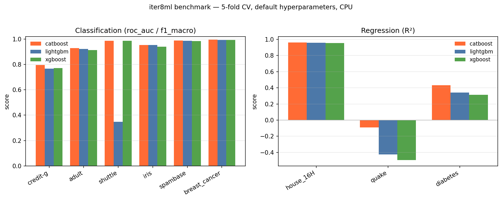

# iter8ml

A high-velocity iteration framework for tabular machine learning. Built for single-node efficiency with Polars-native speed.

## Core Philosophy & Design Goals

- **Fast feedback loops** – from data change to model metric in minutes (not hours/days).
- **Low boilerplate** – common operations (splits, encoding, scaling, evaluation) are one-liners or config-driven.
- **Reproducibility** – every run is tracked (code, data hash, hyperparameters, metrics).
- **Config over code** – hyperparameters, feature lists, model types, and even pipeline steps are defined in YAML/TOML.
- **Extensible** – easy to drop in custom transformers, metrics, or models.

## Benchmark Results

CatBoost / LightGBM / XGBoost, 5-fold cross-validation, **default hyperparameters**, on a laptop CPU (Intel Core Ultra 5, 14 cores). Reproducible via `uv run python benchmarks/render_results.py`.



| Dataset | Task | N | Metric | CatBoost | LightGBM | XGBoost |
|---|---|--:|---|--:|--:|--:|
| credit-g | classification | 1,000 | roc_auc | **0.796 ±0.023** | 0.767 ±0.020 | 0.772 ±0.012 |
| adult | classification | 48,842 | roc_auc | **0.929 ±0.002** | 0.922 ±0.002 | 0.913 ±0.002 |
| shuttle | classification | 58,000 | f1_macro | 0.985 ±0.017 | 0.347 ±0.052 | **0.986 ±0.019** |
| iris | classification | 150 | f1_macro | **0.953 ±0.034** | 0.953 ±0.035 | 0.939 ±0.034 |
| spambase | classification | 4,601 | roc_auc | **0.988 ±0.003** | 0.987 ±0.002 | 0.985 ±0.002 |
| breast_cancer | classification | 569 | roc_auc | **0.995 ±0.005** | 0.992 ±0.008 | 0.994 ±0.004 |
| house_16H | regression | 8,192 | r2 | **0.963 ±0.002** | 0.958 ±0.002 | 0.955 ±0.003 |
| quake | regression | 2,178 | r2 | **-0.092 ±0.024** | -0.425 ±0.096 | -0.495 ±0.092 |
| diabetes | regression | 442 | r2 | **0.432 ±0.064** | 0.340 ±0.070 | 0.315 ±0.109 |

_5-fold CV (mean ± std) · default hyperparameters · CPU · roc_auc (binary) / f1_macro (multiclass) / R² (regression) · best per row in bold._

> **Notes:** Multiclass datasets (`shuttle`, `iris`) report `f1_macro` — OVR-AUC is unstable on imbalanced folds. `shuttle` is extremely class-imbalanced (3 of 7 classes have <15 samples), so default LightGBM underfits the rare classes (f1 0.35 ± 0.05); the framework's class-weighting and HPO steps are designed to close that gap. `quake` is a known noisy regression set (negative R² is expected for all models).

> 📖 **Deep dive — [German Credit case study](https://minghao51.github.io/iter8ml/notebooks/case-study-german-credit/):** takes the `credit-g` row above from benchmark to production. HPO edges ROC-AUC 0.791 → ≈0.796, SHAP ranks `checking_status` / `credit_history` as the top risk drivers, and a drift monitor + portable export bundle come from the same `ExperimentSession` API.

## Quick Start

**Option A: Project install (recommended for development)**

```bash
uv sync --extra gbdt      # GBDT models (CatBoost/LightGBM/XGBoost) + HPO + Hamilton DAG — runs `iter8 run`
uv sync --extra full      # Everything: deep models, tracking, LLM/MCP, SHAP, data quality
uv sync --extra docs      # Documentation tooling

# Run an experiment
uv run iter8 run --data path/to/data.csv --target target_column
```

**Option B: Ephemeral run (no install, for quick experiments)**

```bash
# From git (no local clone) — include the [gbdt] extra so models + Hamilton DAG are available:
uvx --from 'iter8ml[gbdt] @ git+https://github.com/minghao51/iter8ml' iter8 run --data data.csv --target label

# Or from PyPI:
uvx --from 'iter8ml[gbdt]' iter8 run --data data.csv --target label
```

**Option C: Permanent install on PATH**

```bash
uv tool install 'iter8ml[gbdt] @ git+https://github.com/minghao51/iter8ml'
iter8 run --data data.csv --target label
```

## Live Demo

See iter8ml run end-to-end on the bundled **Telco Churn** dataset — a
cross-validated CatBoost-vs-XGBoost leaderboard (CatBoost wins at
ROC-AUC ≈ 0.84) plus a SHAP explanation of the champion, from a single call:

- **Rendered walkthrough:** [Live Demo — Telco Churn](https://minghao51.github.io/iter8ml/notebooks/demo-telco-churn/)
- **Run it in your browser:** [](https://colab.research.google.com/github/minghao51/iter8ml/blob/main/demo/demo_telco_churn.ipynb) (no install — free cloud VM)
- **Or one command locally:** `iter8 init --demo` drops the sample into a workspace and prints the ready-to-paste `iter8 run` line.

For the full deep-dive (HPO, calibration, drift, export), see the
[German Credit case study](https://minghao51.github.io/iter8ml/notebooks/case-study-german-credit/).

## CLI Commands

All commands below use the `uv run` prefix. Replace with `uvx --from 'iter8ml[gbdt]' iter8` or just `iter8` if using Option B or C from Quick Start.

```bash
# Initialize workspace
uv run iter8 init --data path/to/data.csv

# Run experiments
uv run iter8 run --data data.csv --target label
uv run iter8 run --config examples/credit_risk.yaml --models catboost lightgbm
uv run iter8 run --config examples/credit_risk.toml
uv run iter8 run --config examples/credit_risk.json

# Quick iteration mode (2 folds, 20% data, skip SHAP/AFE)
uv run iter8 run --data data.csv --target label --quick

# Resume a previous run (skip already-completed models)
uv run iter8 run --data data.csv --target label --resume

# Compare runs (Side-by-side config & metric diff)
uv run iter8 diff exp_id_1 exp_id_2

# Inspect results
uv run iter8 leaderboard
uv run iter8 leaderboard --top 5 --metric roc_auc

# Manage model registry
uv run iter8 registry show

# Hyperparameter optimization (with warm-start from history)
uv run iter8 hpo --data data.csv --target label --model catboost --trials 100

# Detect data drift (KS-test, PSI, or Domain Classifier)
uv run iter8 drift --reference train.parquet --new batch.parquet

# View experiment state & pipeline lineage
uv run iter8 state

# Check hardware (Auto-detected CUDA/VRAM/CPU)
uv run iter8 hardware
```

## Key Features

- **Hamilton DAG Pipelines** — Function-based DAG with visual lineage, config variants, and lifecycle hooks. See [pipeline-architecture.md](docs/pipeline-architecture.md).
- **Smart Model Routing** — Hardware-aware selection across 7 model families. See [models.md](docs/models.md).
- **Automated Feature Engineering** — Permutation importance top-K, pairwise interaction discovery, and pruning. See [feature-engineering.md](docs/feature-engineering.md).
- **Leakage Audit** — Pre-train permutation test flags "too-good-to-be-true" features. See [preprocessing.md](docs/preprocessing.md).
- **Warm-start HPO** — Historical trial injection + PedAnova importance + search space refinement via Optuna. See [hpo.md](docs/hpo.md).
- **3 Drift Detectors** — KS/Chi-squared, PSI, and domain classifier AUC. See [drift-detection.md](docs/drift-detection.md).
- **SHAP Explainability** — TreeExplainer (GBDTs) and KernelExplainer (others) with beeswarm + dependence plots. See [explainability.md](docs/explainability.md).
- **Probability Calibration** — Platt scaling and isotonic regression post-training. See [evaluation.md](docs/evaluation.md).

## Pipeline Modes

The Hamilton DAG executor supports 5 pipeline modes:

| Mode | CLI Command | Terminal Node | Purpose |
|------|------------|---------------|---------|
| `TRAINING` | `run` | `training_state` | Full experiment (7 modules) |
| `DRIFT` | `drift` | `drift_report` | Compare reference vs live data |
| `EXPORT` | `export` | `processed_dataframe` | Package champion model |
| `HPO` | `hpo` | `processed_dataframe` | Hyperparameter optimization |
| `INFERENCE` | — | `processed_dataframe` | Batch prediction |

## Experiment Configuration

All pipeline behavior is controlled by `ExperimentConfig`. Key knobs:

```python
from iter8ml import ExperimentConfig, PipelineSpec, PipelineStep, StepName

config = ExperimentConfig(
    name="credit_risk_v2",
    task="classification",
    target_col="default",
    data_path="data/credit.csv",

    # Models: "auto" for hardware-aware routing, or a list
    models="auto",

    # Automated feature engineering
    afe_enabled=True,
    afe_top_k=15,
    afe_pruning=True,

    # Pipeline step configuration
    pipeline=PipelineSpec(steps=[
        PipelineStep(name=StepName.TARGET_TRANSFORM, params={"method": "auto"}),
        PipelineStep(name=StepName.CALIBRATION, params={"method": "platt"}),
        PipelineStep(name=StepName.LEAKAGE_AUDIT, enabled=False),
    ]),

    # SHAP explainability
    shap_enabled=True,

    # Concurrency (auto-reduced for low-VRAM GPUs)
    max_workers=2,
)
```

See [pipeline-architecture.md](docs/pipeline-architecture.md) for the full config reference.

## MCP Server (Agentic ML)

Connect Claude Desktop or any MCP client to run experiments conversationally:

```bash
# Install LLM/MCP dependencies
uv sync --extra full

# Start the MCP server
uv run iter8 mcp
```

Available MCP tools: `get_experiment_state`, `get_column_stats`, `run_baseline`, `run_hpo`, `get_event_log`, `registry_show`, `registry_promote`, `detect_drift`, `export_champion`.

Add to your Claude Desktop `claude_desktop_config.json`:

```json
{
  "mcpServers": {
    "iter8ml": {
      "command": "uv",
      "args": ["run", "--directory", "/path/to/iter8ml", "iter8", "mcp"]
    }
  }
}
```

Or with uvx (no local clone needed):

```json
{
  "mcpServers": {
    "iter8ml": {
      "command": "uvx",
      "args": ["--from", "git+https://github.com/minghao51/iter8ml", "--with", "iter8ml[full]", "iter8", "mcp"]
    }
  }
}
```

## Architecture

```
src/iter8ml/
├── cli.py                # CLI entry points
├── config.py             # ExperimentConfig, HardwareProfile
├── constants.py          # Enums (TaskType, CVStrategy, ModelName, TrackerType)
├── data/                 # Polars-native data layer
│   ├── loaders.py        #   CSV, Parquet, SQLite ingestion
│   ├── adapter.py        #   Format conversion (numpy, tensor, HF Dataset)
│   ├── quality.py        #   Cleanlab label noise detection
│   ├── leakage.py        #   Permutation-based leakage audit
│   └── feature_engine.py #   Target transforms, interaction discovery, pruning
├── models/               # Model wrappers + selection
│   ├── baselines.py      #   Naive (mean/mode) + Linear (Logistic/Ridge)
│   ├── conventional/     #   CatBoost, LightGBM, XGBoost
│   ├── deep/             #   FT-Transformer, TabNet, DeBERTa text encoder
│   ├── tabular_foundation/  # TabPFN v2
│   ├── selector.py       #   Hardware-aware model routing
│   └── factory.py        #   Lazy-import model registry
├── engine/               # Orchestration & evaluation
│   ├── trainer.py        #   Top-level experiment orchestrator
│   ├── evaluator.py      #   K-fold CV + metrics registry
│   ├── model_trainer.py  #   Sequential/concurrent training loop
│   ├── hpo.py            #   Optuna study factory + optimization loop
│   ├── calibration.py    #   Platt scaling + isotonic regression
│   └── tracker.py        #   JSONL, W&B, MLflow trackers
├── pipelines/            # Hamilton DAG orchestration
│   ├── executor.py       #   PipelineExecutor (5 modes)
│   ├── nodes/            #   8 node modules (preprocessing, data_prep, etc.)
│   └── hooks/            #   TrackingHook (lifecycle events)
├── monitoring/           # Drift detection & explainability
│   ├── drift.py          #   KS-test + Chi-squared
│   ├── psi_drift.py      #   Population Stability Index
│   ├── domain_classifier.py  # Multivariate drift via classifier AUC
│   └── explainability.py #   SHAP TreeExplainer + KernelExplainer
└── services/             # Reporting, registry, export
    ├── registry_service.py   # Thread-safe model registry
    ├── report_service.py     # Leaderboard + markdown reports
    └── export_service.py     # Portable champion model packaging
```

See [ARCHITECTURE.md](ARCHITECTURE.md) for the detailed design document.

## Documentation

| Document | Content |
|----------|---------|
| [models.md](docs/models.md) | All 7 model implementations, selector logic, factory registry, hyperparameter defaults |
| [evaluation.md](docs/evaluation.md) | CV strategies, metric formulas (RMSE, ROC AUC, R², etc.), lift, calibration |
| [preprocessing.md](docs/preprocessing.md) | Null imputation, date decomposition, encoding, target transforms, quality audit, leakage |
| [feature-engineering.md](docs/feature-engineering.md) | Permutation importance, pairwise interactions, pruning |
| [hpo.md](docs/hpo.md) | Optuna pruners, warmstarting, PedAnova importance, search space refinement |
| [drift-detection.md](docs/drift-detection.md) | KS/Chi-squared, PSI formula, domain classifier AUC |
| [explainability.md](docs/explainability.md) | SHAP TreeExplainer/KernelExplainer, beeswarm + dependence plots |
| [data-loading.md](docs/data-loading.md) | CSV/Parquet/SQLite loading, security measures, data hashing |
| [pipeline-architecture.md](docs/pipeline-architecture.md) | Hamilton DAG composition, config variants, hooks, extension guide |
| [design-decisions.md](docs/design-decisions.md) | The *why* behind the architecture — ADR-style notes (DAG, medallion contract, hardware routing, CPU-first) |
| [medallion.md](docs/medallion.md) | Local Bronze/Silver/Gold/Platinum products, atomic artifacts, catalog, and verification |

## Optional Integrations

**With `uv sync` (project install):**

```bash
uv sync --extra gbdt        # GBDT models + HPO + Hamilton DAG (enough for `iter8 run`)
uv sync --extra train       # gbdt + deep models, tracking, LLM/MCP, SHAP, data quality
uv sync --extra full        # train + docs
uv sync --extra docs        # Documentation tooling (mkdocs, mkdocstrings, mike)
```

| Extra | Packages |
|-------|----------|
| `gbdt` | catboost, lightgbm, xgboost, optuna, sf-hamilton |
| `train` | gbdt + torch, accelerate, transformers, tabpfn, pytorch-tabular, wandb, mlflow, mcp, litellm, shap, cleanlab |
| `full` | train + docs |
| `docs` | mkdocs-material, mkdocstrings, mike, pymdown-extensions, matplotlib |

**With `uvx` (ephemeral):**

```bash
uvx --from 'iter8ml[gbdt] @ git+https://github.com/minghao51/iter8ml' --with wandb iter8 run --data data.csv --target label
```

## Running in Docker

```bash
docker build -t iter8ml .
docker run -v $(pwd):/workspace iter8ml iter8 run --data data.csv --target label
```

## Development

```bash
# Install development/test extras
uv sync --group dev --extra full

# Run tests
uv run --group dev --extra full pytest tests/unit -v

# Lint
uv run --group dev ruff check .

# Format
uv run --group dev ruff format .
```

## License

MIT
