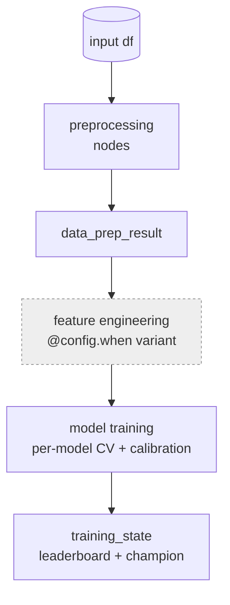

# ADR-0001: One Hamilton DAG for training, not imperative orchestration

- **Status:** Accepted
- **Provenance:** recorded 2026-08-29, split verbatim from `docs/design-decisions.md`

## Context

Tabular-ML codebases tend to grow into a tangle of notebooks and
scripts where preprocessing is copy-pasted between train, inference, and drift
paths. Three artifacts that should be identical slowly diverge; lineage is
"read the notebook"; nothing is replayable below the run level.

## Decision

Training execution is a **single Hamilton DAG**. Each Python
function is a node whose parameters *declare* its dependencies; Hamilton resolves
execution order. There is no parallel imperative path for training.

## Consequences

- **+** Lineage and per-node timing come free via lifecycle hooks; preprocessing
  is defined once and reused across every pipeline mode.
- **+** Any node is independently runnable (`run_preprocessing`, `run_drift`),
  which is what makes `iter8 drift` and `iter8 run` share the same graph.
- **−** Framework lock-in to Hamilton; every stage must be a pure function, which
  is occasionally awkward for stateful fits.
- **−** A reader can't follow execution top-to-bottom in one file — they read the
  graph. `iter8 plan --graph` and `describe_pipeline()` exist to compensate.
