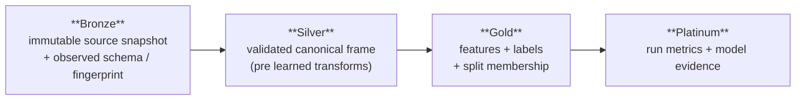

# ADR-0003: A medallion artifact contract for durable lineage

- **Status:** Accepted (hardened local slice — see Honest status)
- **Provenance:** recorded 2026-08-29, split verbatim from `docs/design-decisions.md`

## Context

ML artifacts are too often ad-hoc `parquet` dumps with no schema,
no fingerprint, and no lineage. "Resume this run" usually means "trust the last
line in the log" — which is exactly the thing most likely to be wrong after a
crash.

## Decision

Borrow the data-engineering medallion pattern as a local-first
artifact contract:

A product is readable only after its manifest and `_SUCCESS` marker commit
atomically. `MedallionExecutionService.resume(run_id)` trusts **only** a terminal
`run.json` whose recorded stage products pass deep checksum verification — event
history alone is never a checkpoint. The Gold split artifact records
`row_id / fold / role / repeat`, and verification rejects train/validation
overlap within a fold.

## Consequences

- **+** Runs are reproducible and auditable; resume is safe; the most common
  leakage bug (train/val overlap) is caught at the contract boundary.
- **−** More plumbing and more disk than dumping files.
- **− Honest status:** this is a hardened *local reference slice*, not completion
  of every medallion phase. Model-per-fold Platinum, OOF artifacts, a true DuckDB
  catalog over Parquet views, and migration tooling remain future work
  (tracked in [deferred research](../plan/deferred-research.md)).

## Addendum (2026-09-01): flat-path resume policy

The legacy flat path (`iter8 run` → `experiments.jsonl`) still resumes completed
models and builds reports from event history alone — the thing this ADR says is
"never a checkpoint." That tension is acknowledged, not resolved: the flat path
sits behind ADR-0005's best-effort event seam and is now hardened against torn
trailing writes and rotated-log loss (`iter_events(on_error=...)`, plus rotated
backup reads and dedupe in `ReportService`), but it is not a durable checkpoint.
The durable-fix direction is the medallion `run.json` manifest pattern already
implemented in `orchestration/service.py`: resume trusts only a
checksum-verified terminal manifest. Porting the flat trainer onto that
manifest is explicitly out of scope for the current workstream.
