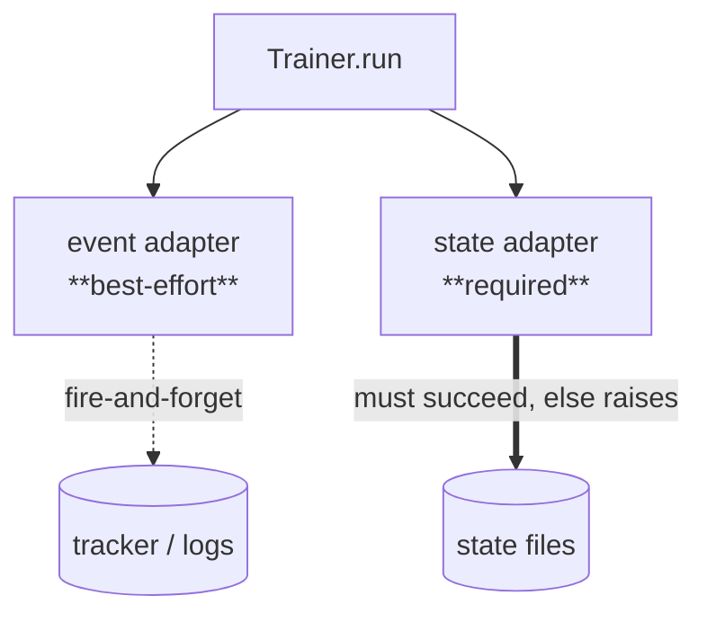

# ADR-0005: Two reliability seams: best-effort events, required state

- **Status:** Accepted
- **Provenance:** recorded 2026-08-29, split verbatim from `docs/design-decisions.md`

## Context

A training run emits two qualitatively different outputs:
*telemetry* (node timings, trial logs — nice to have) and *state* (the
leaderboard, the registered champion — must not be lost). Treating both as
"logging" means a telemetry hiccup can abort a run, or a partial-failure state
can be silently dropped.

## Decision

The `Trainer` exposes two seams with deliberately different
reliability contracts:

The event adapter (`TrackerEventAdapter`) is best-effort — a failure is logged
and the run continues. The state adapter (`ObserverStateAdapter`) is **required**:
if it fails, the `Trainer` raises `TrainerStatePublishError` rather than claim
success.

## Consequences

- **+** State integrity is guaranteed; telemetry can never crash a run.
- **−** Two concepts to understand instead of one "logger." That is the point —
  conflating them is what loses state.
