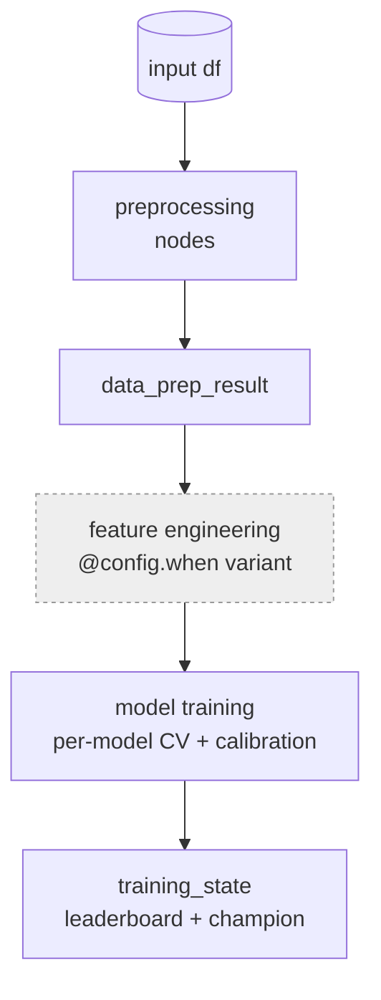
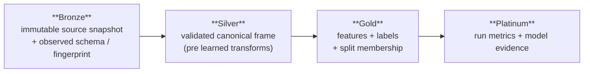
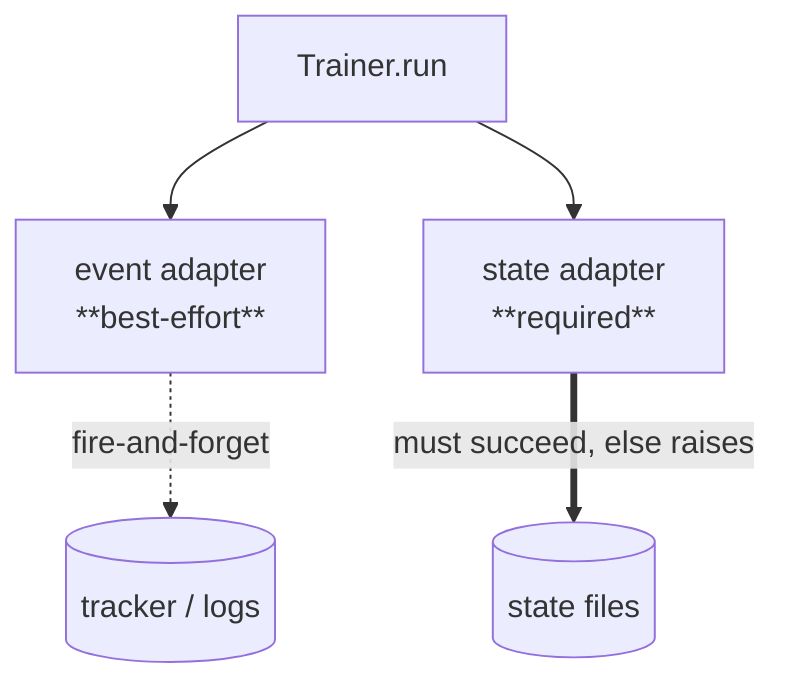

# Design Decisions

iter8ml's architecture is the product of a handful of deliberate tradeoffs. This
page records the **why**, not the **what** — for each decision, the context that
forced the choice, the decision we made, and the consequences we accepted. It is
intentionally honest about what is finished and what is not.

Each record follows the ADR shape: **Context → Decision → Consequences**.
Reference detail lives in [Pipeline Architecture](pipeline-architecture.md) and
[Medallion Runtime](medallion.md).

---

## ADR-001 — One Hamilton DAG for training, not imperative orchestration

**Context.** Tabular-ML codebases tend to grow into a tangle of notebooks and
scripts where preprocessing is copy-pasted between train, inference, and drift
paths. Three artifacts that should be identical slowly diverge; lineage is
"read the notebook"; nothing is replayable below the run level.

**Decision.** Training execution is a **single Hamilton DAG**. Each Python
function is a node whose parameters *declare* its dependencies; Hamilton resolves
execution order. There is no parallel imperative path for training.

**Consequences.**
- **+** Lineage and per-node timing come free via lifecycle hooks; preprocessing
  is defined once and reused across every pipeline mode.
- **+** Any node is independently runnable (`run_preprocessing`, `run_drift`),
  which is what makes `iter8 drift` and `iter8 run` share the same graph.
- **−** Framework lock-in to Hamilton; every stage must be a pure function, which
  is occasionally awkward for stateful fits.
- **−** A reader can't follow execution top-to-bottom in one file — they read the
  graph. `iter8 plan --graph` and `describe_pipeline()` exist to compensate.

---

## ADR-002 — Pipeline behavior is *data* (`PipelineSpec` + `@config.when`), not branches

**Context.** A real pipeline has many behavior switches: drift method
(psi / domain-classifier / both), target transform (none / log1p / yeo-johnson /
box-cox), calibration (none / platt / isotonic), feature strategy. Encoding these
as `if/else` inside node code produces an exponential tangle that is impossible
to introspect or serialize.

**Decision.** Steps and their parameters live in a serializable
[`PipelineSpec`](pipeline-architecture.md); nodes
select implementations with Hamilton's `@config.when(...)`. The node code itself
has no branching — the config activates the right variant.

**Consequences.**
- **+** A pipeline is queryable and describable — `describe_pipeline(spec)`
  returns exactly what will run, and `visualize_pipeline(spec)` annotates disabled
  steps. That same data drives `iter8 plan --graph`.
- **+** Adding a variant is purely additive (a new `@config.when` function); no
  existing node changes.
- **−** Indirection: to know *what* runs you read the spec, not the code. The
  spec→config resolver (`_resolve_hamilton_config`) is a thing that can be
  forgotten when adding a param.

---

## ADR-003 — A medallion artifact contract for durable lineage

**Context.** ML artifacts are too often ad-hoc `parquet` dumps with no schema,
no fingerprint, and no lineage. "Resume this run" usually means "trust the last
line in the log" — which is exactly the thing most likely to be wrong after a
crash.

**Decision.** Borrow the data-engineering medallion pattern as a local-first
artifact contract:

A product is readable only after its manifest and `_SUCCESS` marker commit
atomically. `MedallionExecutionService.resume(run_id)` trusts **only** a terminal
`run.json` whose recorded stage products pass deep checksum verification — event
history alone is never a checkpoint. The Gold split artifact records
`row_id / fold / role / repeat`, and verification rejects train/validation
overlap within a fold.

**Consequences.**
- **+** Runs are reproducible and auditable; resume is safe; the most common
  leakage bug (train/val overlap) is caught at the contract boundary.
- **−** More plumbing and more disk than dumping files.
- **− Honest status:** this is a hardened *local reference slice*, not completion
  of every medallion phase. Model-per-fold Platinum, OOF artifacts, a true DuckDB
  catalog over Parquet views, and migration tooling remain future work.

---

## ADR-004 — Hardware-aware model routing (and the OpenMP war story)

**Context.** "Which models should I run?" should not be a manual decision, and
the defaults should not depend on hoping the host has a GPU. Worse, the naive
defaults actively break: on hybrid (P+E-core) CPUs under Linux/WSL2, the GBDT
libraries' libgomp **deadlocks across all cores** — the process hangs silently
and exits `124` (Phase-1 issue 1.6b). `n_jobs=-1` is a footgun.

**Decision.** `models="auto"` resolves through a `ModelSelector` keyed on the
task and **detected VRAM**; `max_workers` is auto-reduced to 1 on low-VRAM GPUs;
and OpenMP threads are capped (`HardwareProfile.configure_omp_threads()`,
≤8 on Linux) **before any GBDT library is allowed to load libgomp**.

**Consequences.**
- **+** A sensible, host-appropriate default with zero configuration; no
  silent deadlocks; reproducible CPU runs.
- **−** "auto" can surprise a user who expected a specific model — pin an
  explicit `models=[...]` list to opt out. The lazy GBDT load also means the OMP
  guard must run early in any entrypoint (notebook/demo/CLI) — see the case
  study's hidden setup cell.

---

## ADR-005 — Two reliability seams: best-effort events, required state

**Context.** A training run emits two qualitatively different outputs:
*telemetry* (node timings, trial logs — nice to have) and *state* (the
leaderboard, the registered champion — must not be lost). Treating both as
"logging" means a telemetry hiccup can abort a run, or a partial-failure state
can be silently dropped.

**Decision.** The `Trainer` exposes two seams with deliberately different
reliability contracts:

The event adapter (`TrackerEventAdapter`) is best-effort — a failure is logged
and the run continues. The state adapter (`ObserverStateAdapter`) is **required**:
if it fails, the `Trainer` raises `TrainerStatePublishError` rather than claim
success.

**Consequences.**
- **+** State integrity is guaranteed; telemetry can never crash a run.
- **−** Two concepts to understand instead of one "logger." That is the point —
  conflating them is what loses state.

---

## ADR-006 — CPU-first, GPU-ready

**Context.** Most tabular datasets fit comfortably on a laptop CPU, and CPU
access is near-universal while GPU access is uneven. Yet many frameworks treat
CPU as an afterthought or assume a GPU. That inverts the real distribution of
tabular work.

**Decision.** iter8ml is **CPU-first**: a dedicated CPU benchmark suite and the
OpenMP hardening above (ADR-004) make the CPU path a first-class, reproducible
target — the path that runs in CI and on any machine.

This is **not** CPU-only. The same hardware detection that powers model routing
(ADR-004) auto-detects VRAM when a GPU is present and routes to it —
GPU-appropriate models are selected, `max_workers` scales up, and the GPU path is
exercised, not merely permitted. Both paths are real and tested; CPU is the
default, GPU is a first-class opt-in the host enables by having one.

**Consequences.**
- **+** Runs anywhere; reproducible, free CI; low friction for the common
  (small-to-medium tabular) case.
- **−** For very large data or deep models the CPU path is slower — which is
  exactly when the auto-detected GPU path takes over.

---

## Aside — Polars-native, with a narrow numpy seam

End-to-end data is [Polars](https://pola.rs) (`pl.DataFrame`); numpy `(X, y)`
arrays appear only at the model boundary via `DataAdapter`. This gives
lazy/Arrow-native throughput and keeps transforms memoizable inside the DAG, at
the cost of one conversion at the seam — kept deliberately narrow.

---

## Status

These decisions are stable; the implementation around them is staged. The
medallion contract (ADR-003) in particular is explicitly a hardened local slice
today, with a real catalog and further Platinum execution on the roadmap. See
the [German Credit case study](notebooks/case-study-german-credit.md) for these
decisions exercised end-to-end on a real dataset.
