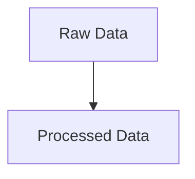

# Current Experiment State

**Task:** Classification
**Dataset:** unknown
**Rows / Features:** ? / ?
**Latest Run ID:** exp_1777826342_b98a79

## Leaderboard

| Rank | Model | Run ID | Primary Metric | Score | Duration |
|---|---|---|---|---|---|
| 1 | CatBoost | exp_1777826342_b98a79 | roc_auc | 0.9835 | 5.07s |
| 2 | LightGBM | exp_1777826342_b98a79 | roc_auc | 0.9806 | 1.86s |
| 3 | XGBoost | exp_1777826342_b98a79 | roc_auc | 0.9767 | 0.92s |

## Resource Status

Device: cpu
VRAM Used: 0 GB

## Registered Champions

- **quickstart_demo:classification**: catboost (score: 0.9835297349933748)

## Data Pipeline

